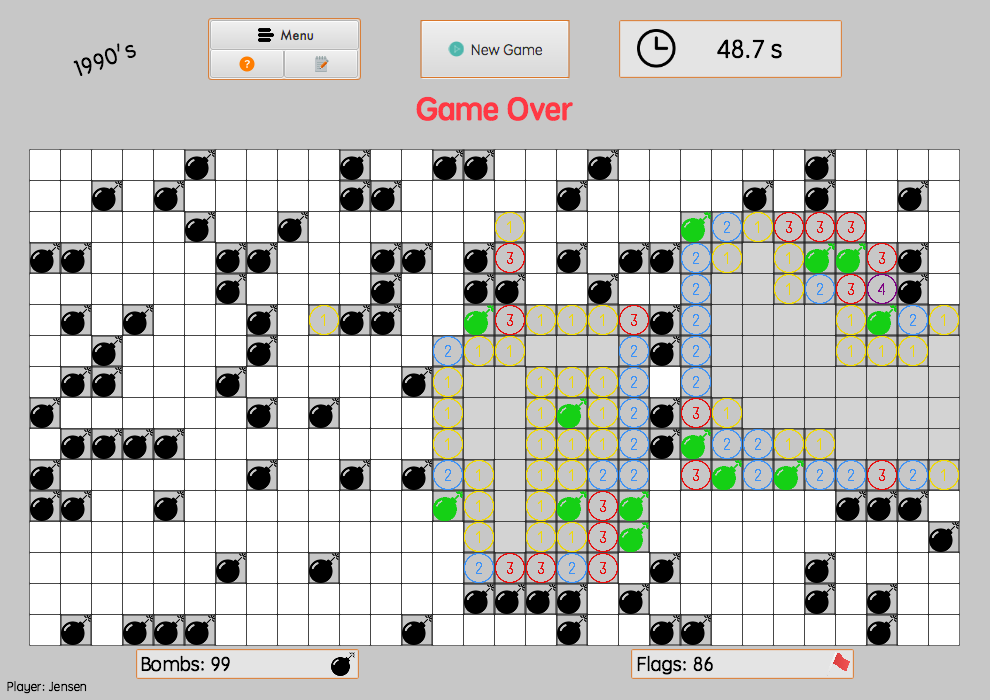
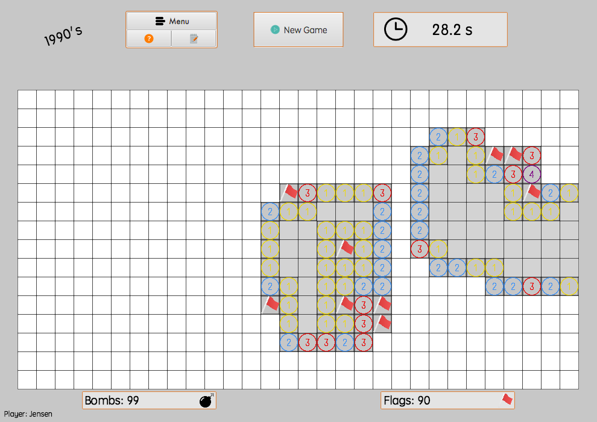

# Minesweeper
A Java replica of the classic Microsoft Minesweeper game in MacOS! :bomb:

[Wikipeida](https://en.wikipedia.org/wiki/Microsoft_Minesweeper)

Created by <b>Jensen</b> on June 28th, 2017

--- 

### Features

- Play three gamemodes (Easy, Medium, Hard)
- Custom board feature
- Save Highscores
- Take screenshots of gameplay :camera:
- And Much More!

### Download

Only MacOS at the moment

Download above or [HERE](https://github.com/CaptainJensen/Minesweeper/releases)

Current version: <b> v17.2.4-beta

### Pictures!
 

